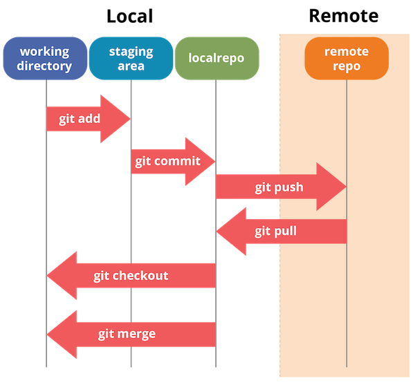

## GitHub **Super-Quick** Tutorial

---

@snap[north-west span-50 text-center]
#### 1. What is GitHub?
@snapend

@snap[west span-55]
@ul[list-spaced-bullets text-09]
* Version control tool
* Command line tool (Web GUI is helpful)
@ulend
@snap[west span-55]

---

### 2. How to use?

@ul
1. Make an account
2. Make a new **repository**
3. Update the repository
@ulend

---

### 3. What is Repository?

* A unit of project (a sort of directory)
* **Local repository** the files in your computer
* **Remote repository** the files in the GitHub server

---

### 4. How to update?

1. **Add** a new file to the repository
2. **Commit** the file to the local repository
3. **Push**  the file to the remote repository

---

### 5. Additional important 3 operations

1. **Status**: check the file status
2. **Clone**: copy all the files in the remote repository to your computer, and make a local repository
3. **Pull**: update/syncronize the local repository to the remote repository

---

### 6. Summary

Link
* https://www.edureka.co/blog/git-tutorial/
* https://d1jnx9ba8s6j9r.cloudfront.net/blog/wp-content/uploads/2016/11/Git-Architechture-Git-Tutorial-Edureka-2.png)

---

# Demonstration

